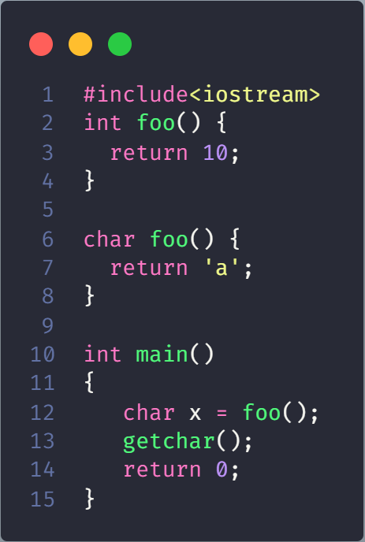
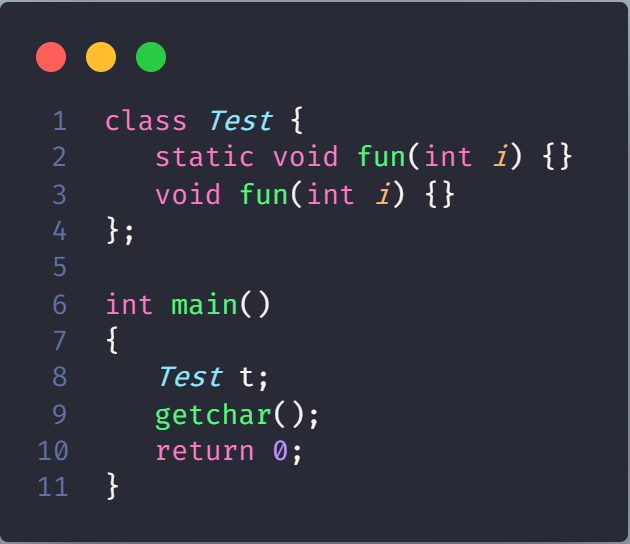
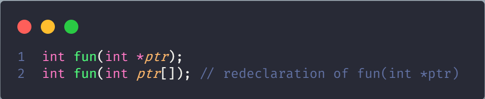
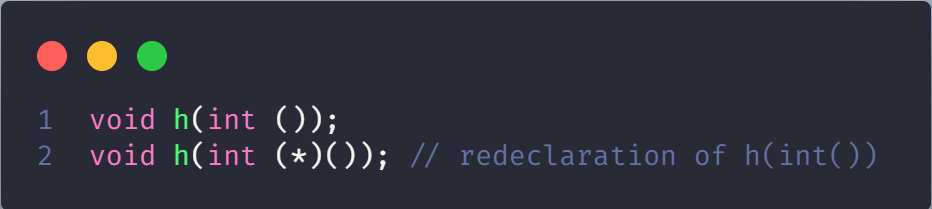
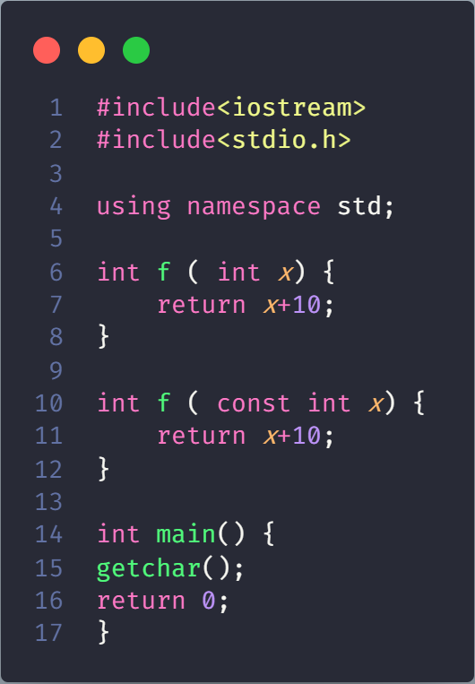
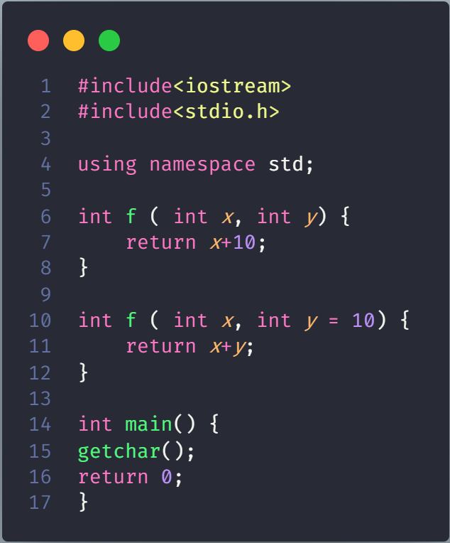

# Functions that cannot be overloaded in C++

## Function declarations that differ only in the return type

## Member function declarations with the same name and the name parameter-type-list cannot be overloaded if any of them is a static member function declaration

## Parameter declarations that differ only in a pointer * versus an array [] are equivalent

That is, the array declaration is adjusted to become a pointer declaration. Only the second and subsequent array dimensions are significant in parameter types

> two function declarations are equivalent

## Parameter declarations that differ only in that one is a function type and the other is a pointer to the same function type are equivalent

## Parameter declarations that differ only in the presence or absence of const and/or volatile are equivalent

That is, the const and volatile type-specifiers for each parameter type are ignored when determining which function is being declared, defined, or called

Only the const and volatile type-specifiers at the outermost level of the parameter type specification are ignored in this fashion; const and volatile type-specifiers buried within a parameter type specification are significant and can be used to distinguish overloaded function declarations

## Two parameter declarations that differ only in their default arguments are equivalent

