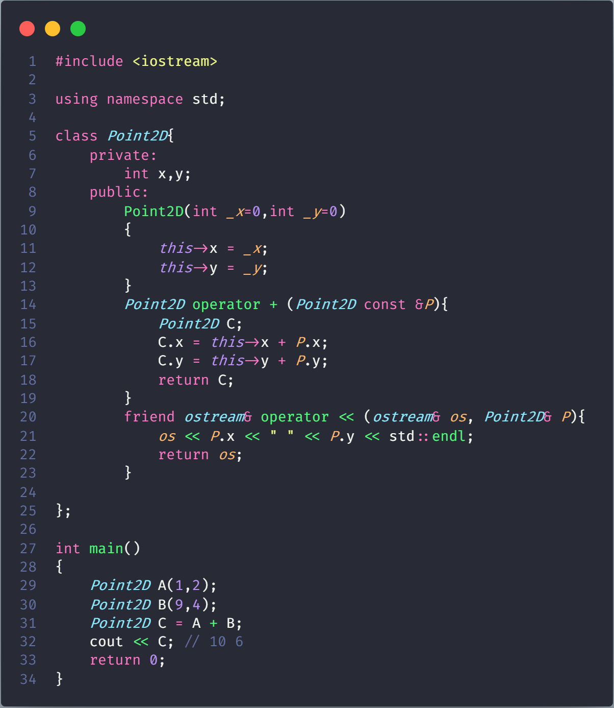
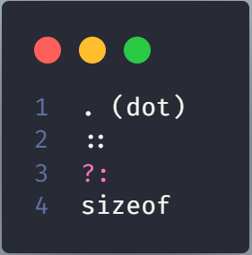
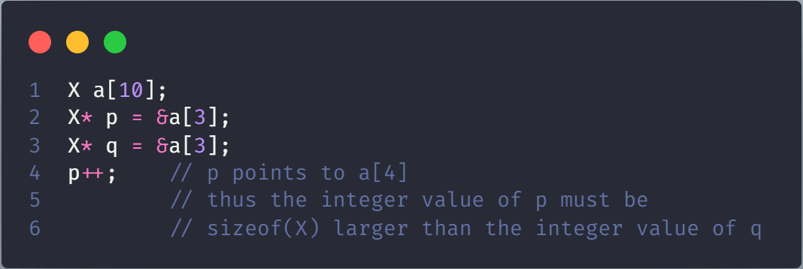
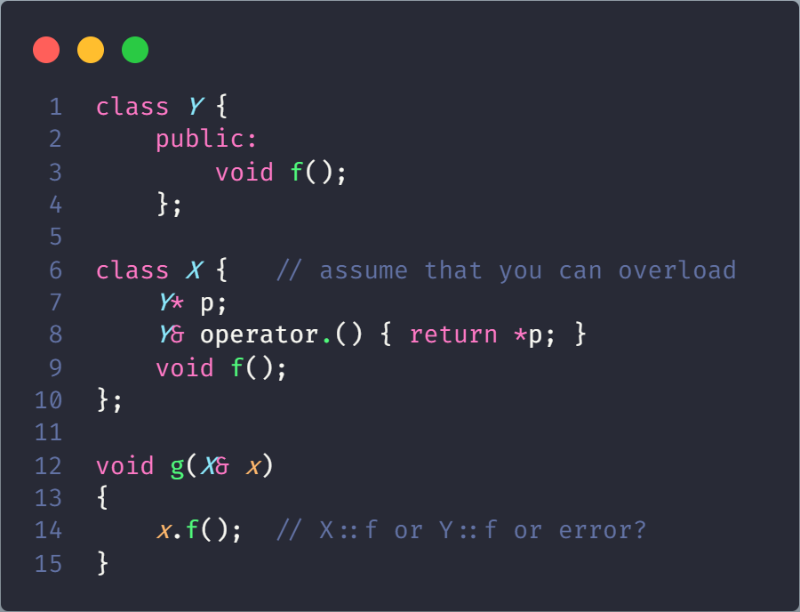
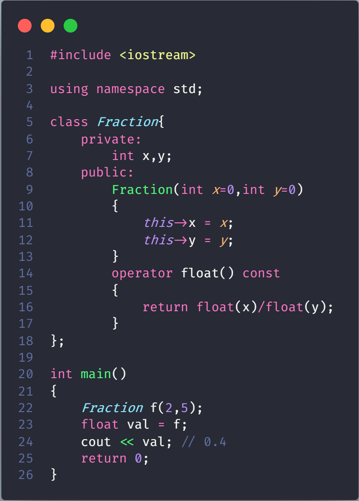
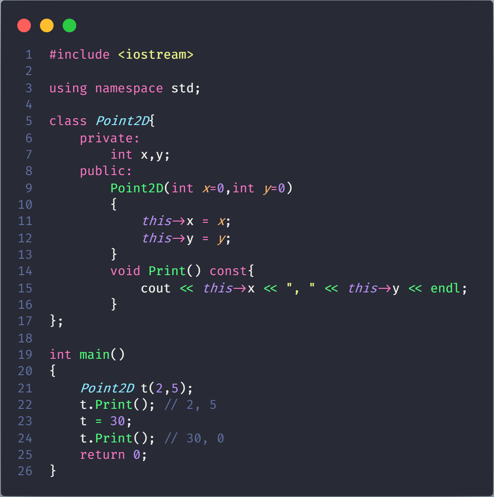

# Operator Overloading in C++

In C++, we can make operators to work for user defined classes. This means C++ has the ability to provide the operators with a special meaning for a data type, this ability is known as operator overloading

## A simple and complete example

## What is the difference between operator functions and normal functions?

Operator functions are same as normal functions. The only differences are, name of an operator function is always operator keyword followed by symbol of operator and operator functions are called when the corresponding operator is used.

## Can we overload all operators?

Almost all operators can be overloaded except few. Following is the list of operators that cannot be overloaded.

### Why cannot overload?

- There is no fundamental reason to disallow overloading of ?:. I just didn't see the need to introduce the special case of overloading a ternary operator. Note that a function overloading expr1?expr2:expr3 would not be able to guarantee that only one of expr2 and expr3 was executed

- Sizeof cannot be overloaded because built-in operations, such as incrementing a pointer into an array implicitly depends on it. Thus, sizeof(X) could not be given a new and different meaning by the programmer without violating basic language rules.Consider:

- In N::m neither N nor m are expressions with values; N and m are names known to the compiler and :: performs a (compile time) scope resolution rather than an expression evaluation. One could imagine allowing overloading of x::y where x is an object rather than a namespace or a class, but that would - contrary to first appearances - involve introducing new syntax (to allow expr::expr). It is not obvious what benefits such a complication would bring.

- Operator . (dot) could in principle be overloaded using the same technique as used for ->. However, doing so can lead to questions about whether an operation is meant for the object overloading . or an object referred to by

## Important points about operator overloading

- For operator overloading to work, at least one of the operands must be a user defined class object

- **Assignment Operator**: Compiler automatically creates a default assignment operator with every class. The default assignment*t operator does assign all members of right side to the left side and works fine most of the cases (this behavior is same as copy constructor). The reason write our own assignment operator: [here](WriteAssignmentOperator/README.md)

    

    > Overloaded conversion operators must be a member method. Other operators can either be member method or global method.

- **Conversion Operator**: We can also write conversion operators that can be used to convert one type to another type

- Any constructor that can be called with a single argument works as a conversion constructor, means it can also be used for implicit conversion to the class being constructed.

    
