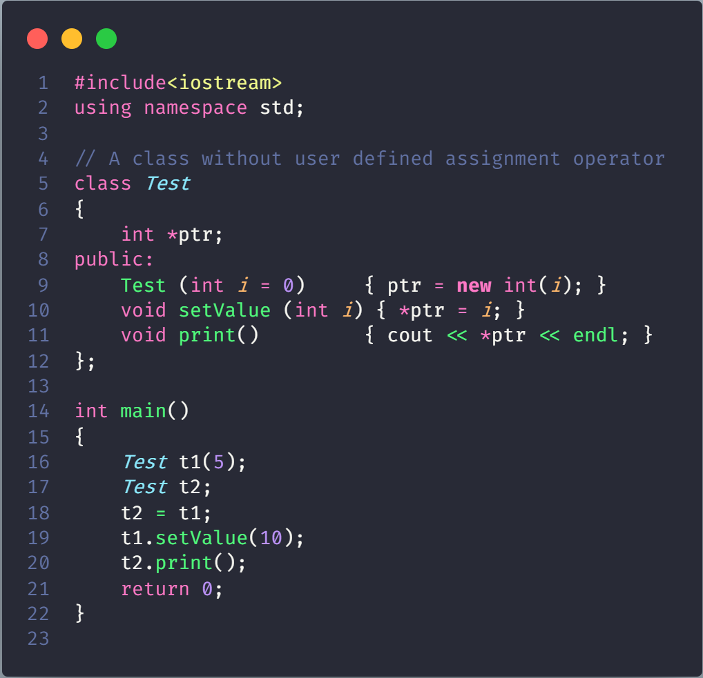
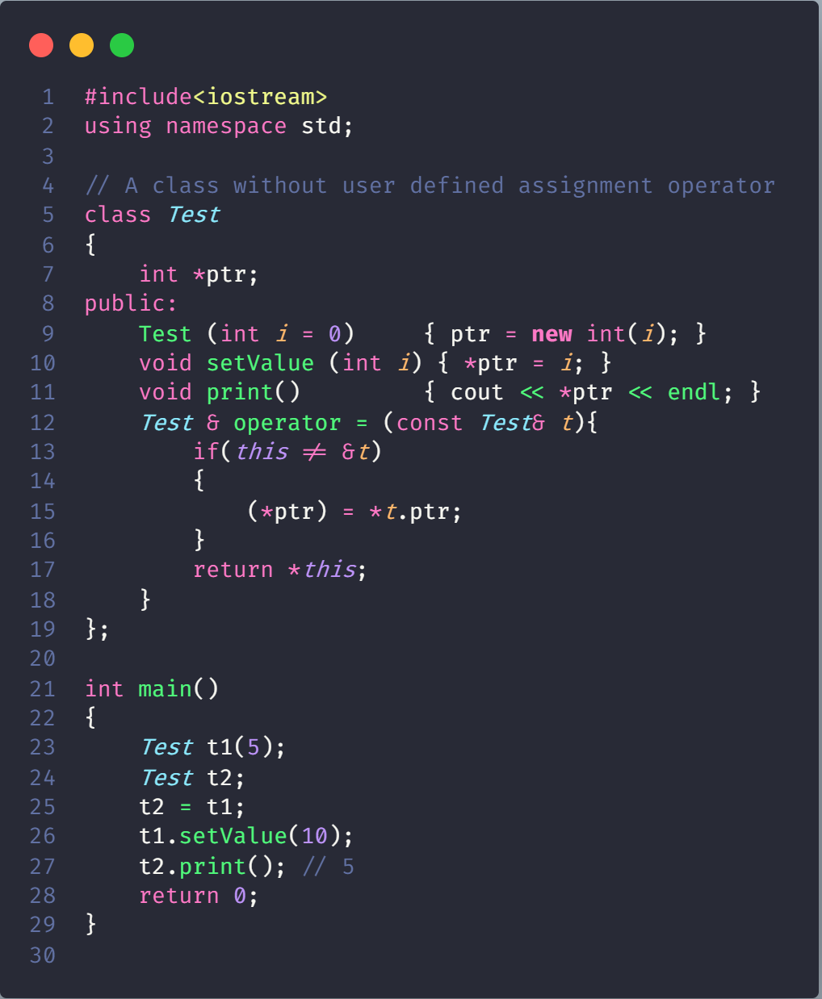

# When should we write our own assignment operator in C++?

The answer is same as Copy Constructor. If a class doesn’t contain pointers, then there is no need to write assignment operator and copy constructor. The compiler creates a default copy constructor and assignment operators for every class. The compiler created copy constructor and assignment operator may not be sufficient when we have pointers or any run time allocation of resource like file handle, a network connection..etc

Output of above program is “10”. If we take a look at main(), we modified ‘t1’ using setValue() function, but the changes are also reflected in object ‘t2’

## Handle the above problem in two ways

- Do not allow assignment of one object to other object. We can create our own dummy assignment operator and make it private.

- Write your own assignment operator that does deep copy. Same is true for Copy Constructor.

Note the if condition in assignment operator. While overloading assignment operator, we must check for self assignment. Otherwise assigning an object to itself may lead to unexpected result. Self assignment check is not necessary for the above ‘Test’ class, because ‘ptr’ always points to one integer and we may reuse the same memory. But in general, it is a recommended practice to do self-assignment check.
