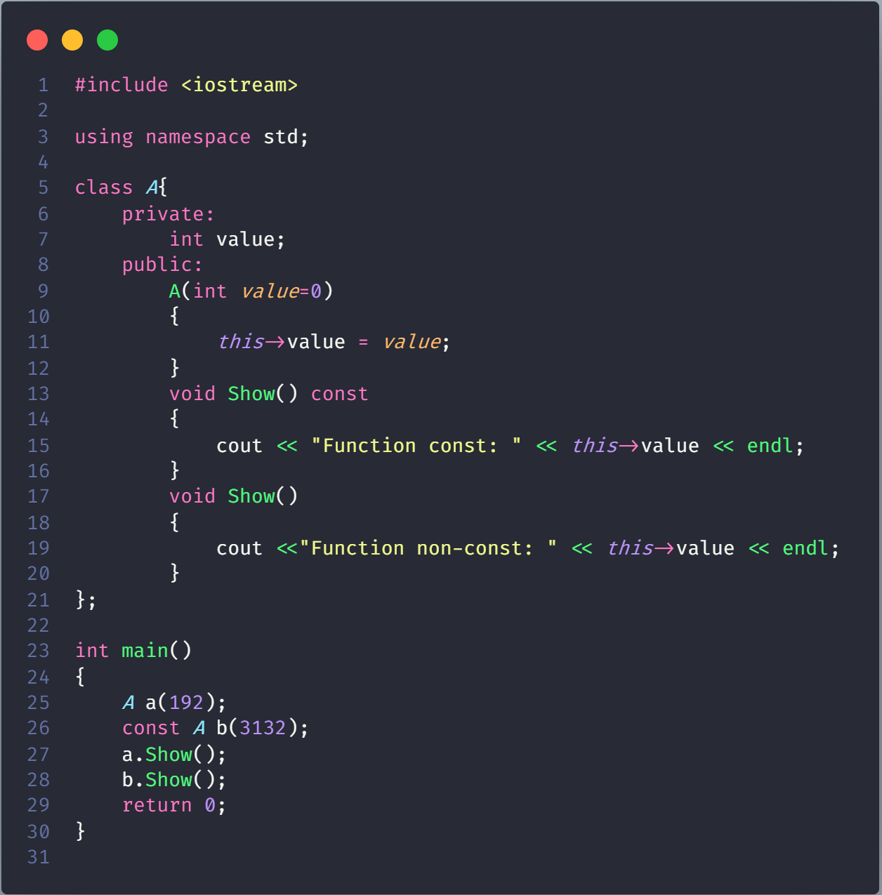
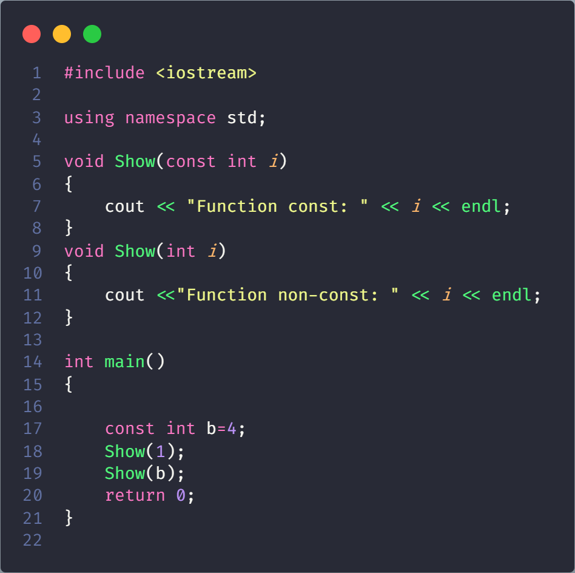
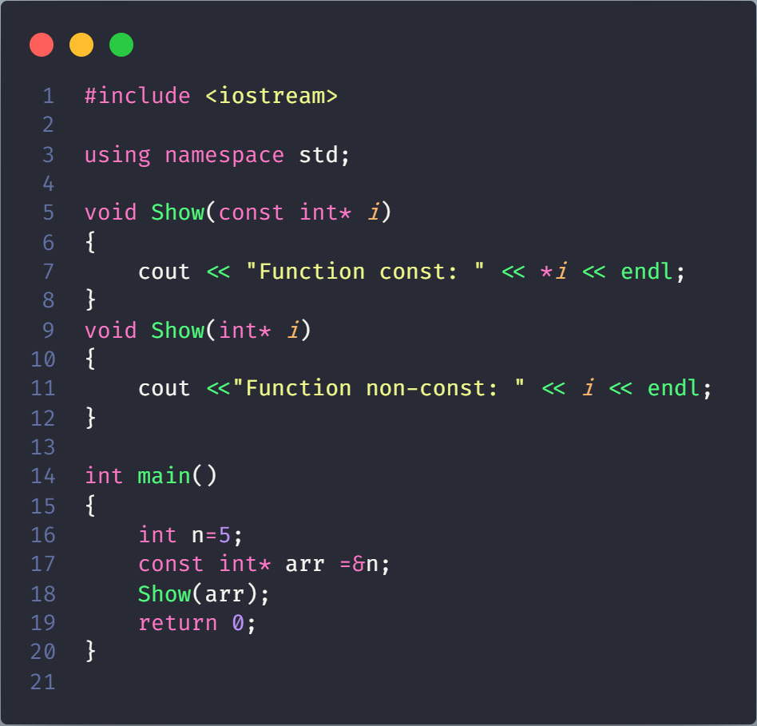
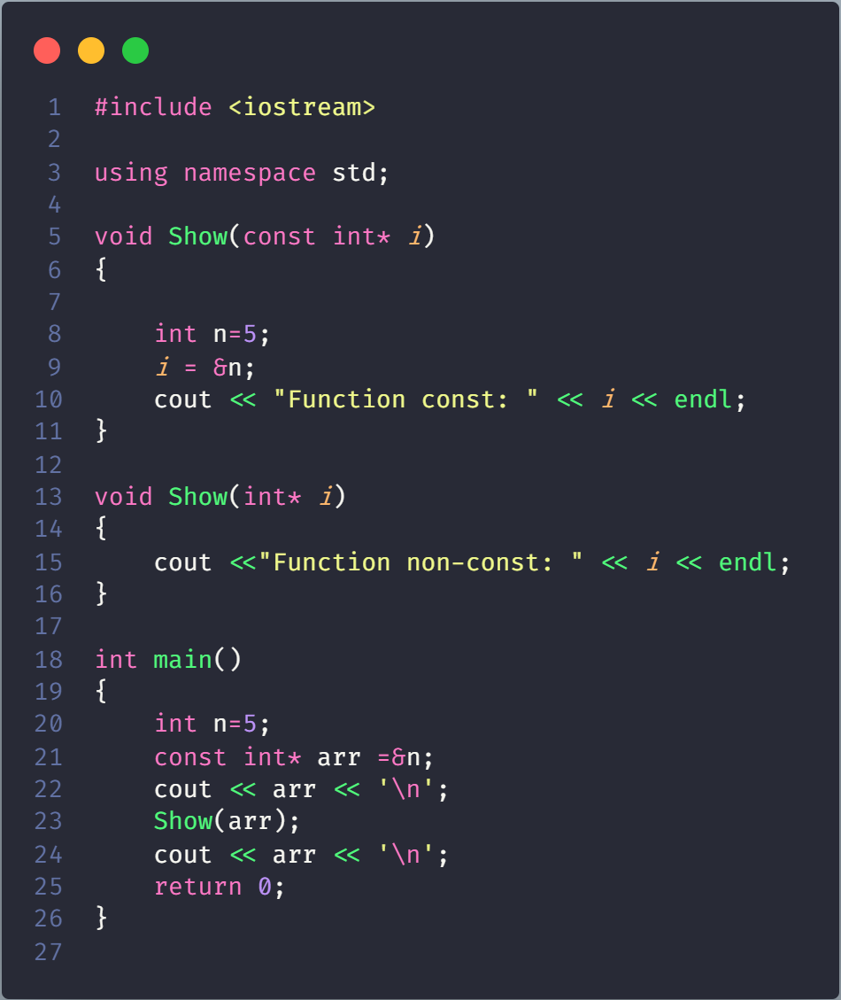
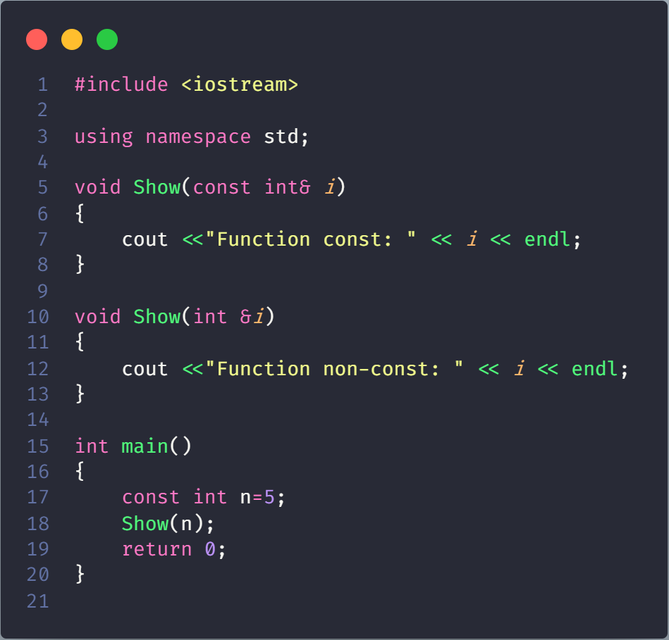

# Function overloading and const keyword



```json
Function non-const: 192
Function const: 3132
```

The two methods ‘void fun() const’ and ‘void fun()’ have same signature except that one is const and other is not. Also, if we take a closer look at the output, we observe that, ‘const void fun()’ is called on const object and ‘void fun()’ is called on non-const object.

C++ allows member methods to be overloaded on the basis of const type. Overloading on the basis of const type can be useful when a function return reference or pointer. We can make one function const, that returns a const reference or const pointer, other non-const function, that returns non-const reference or pointer.

## What about parameters?

Rules related to const parameters are interesting.

Code Wrong:



```json
Compiler Error: redefinition of 'void Show(int)'
```

Code True:


```json
Function const: 5
```

C++ allows functions to be overloaded on the basis of const-ness of parameters only if the const parameter is a reference or a pointer. That is why the program 1 failed in compilation, but the program 2 worked fine. This rule actually makes sense. In program 1, the parameter ‘i’ is passed by value, so ‘i’ in fun() is a copy of ‘i’ in main(). Hence fun() cannot modify ‘i’ of main(). Therefore, it doesn’t matter whether ‘i’ is received as a const parameter or normal parameter. When we pass by reference or pointer, we can modify the value referred or pointed, so we can have two versions of a function, one which can modify the referred or pointed value, other which can not.



```json
0x61feb8
Function const: 0x61fe8c
0x61feb8
```



```json
Function const: 5
```
