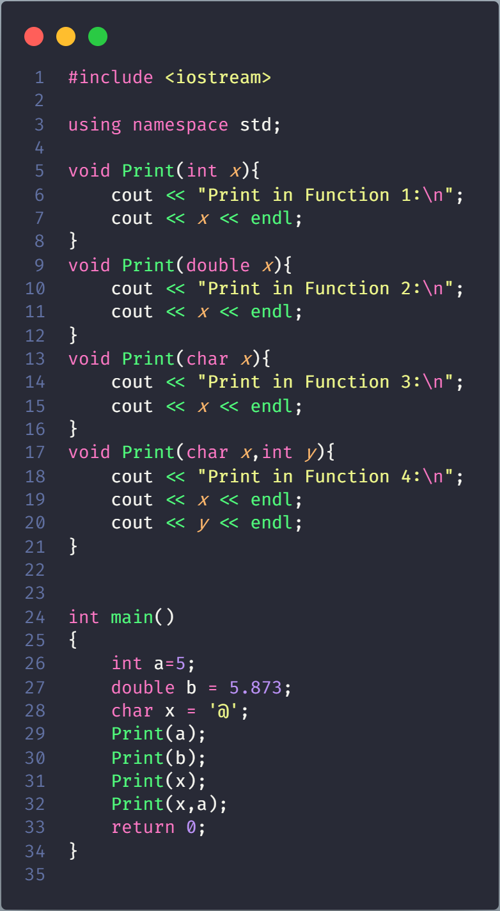
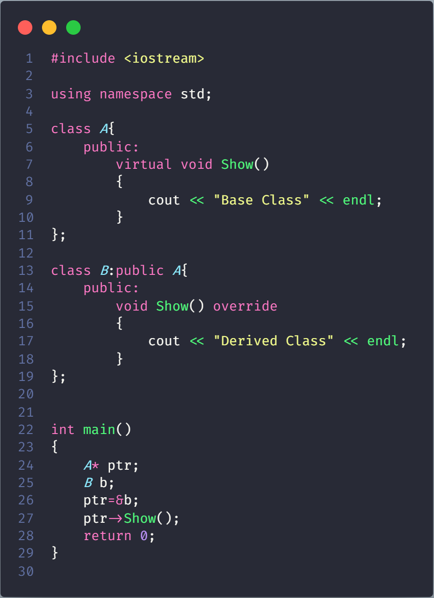

# Function Overloading vs Function Overriding in C++

## Function Overloading (achieved at compile time)

It provides multiple definitions of the function by changing signature i.e changing number of parameters, change datatype of parameters, return type doesn’t play anyrole.



```json
Print in Function 1: 5
Print in Function 2: 5.873
Print in Function 3: @
Print in Function 4: @ 5
```

## Function Overriding (achieved at run time)

It is the redefinition of base class function in its derived class with same signature i.e return type and parameters.



```json
Derived Class
```

**NOTE**: It can only be done in derived class.

## Function Overloading VS Function Overriding

- **Inheritance**: Overriding of functions occurs when one class is inherited from another class. Overloading can occur without inheritance.

- **Function Signature**: Overloaded functions must differ in function signature ie either number of parameters or type of parameters should differ. In overriding, function signatures must be same.

- **Scope of functions**: Overridden functions are in different scopes; whereas overloaded functions are in same scope.

- **Behavior of functions**: Overriding is needed when derived class function has to do some added or different job than the base class function. Overloading is used to have same name functions which behave differently depending upon parameters passed to them.
