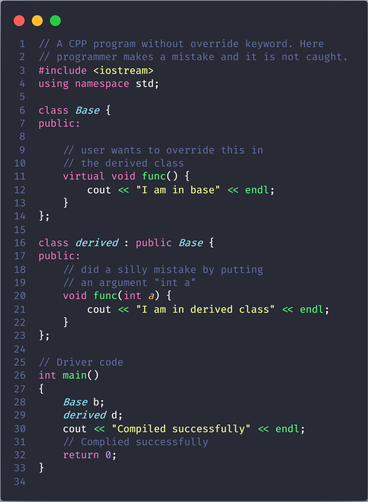
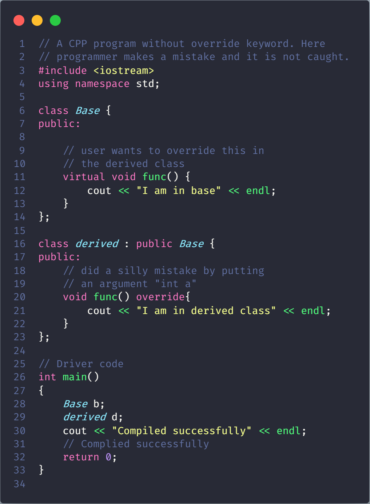

# Override Keyword in C++

[Function Overriding](FunctionOverriding/README.md) is redefinition of base class function in its derived class with same signature i.e return type and parameters.
C++11 has come up with the keyword override. It will make the compiler to check the base class to see if there is a virtual function with this exact signature. And if there is not, the compiler will show an error.

**Explanation**: Here the user intended to override the function func() in the derived class but did a silly mistake and redefined the function with different signature. Which was not detected by the compiler. However, the program is not actually what the user wanted. So, to get rid of such silly mistake to be in safe side, override keyword can be used.

In short, it serves the following functions. It helps to check if:

- There is a method with the same name in the parent class.

- The method in the parent class is declared as “virtual” which means it was intended to be rewritten.

- The method in the parent class has the same signature as the method in the subclass.
