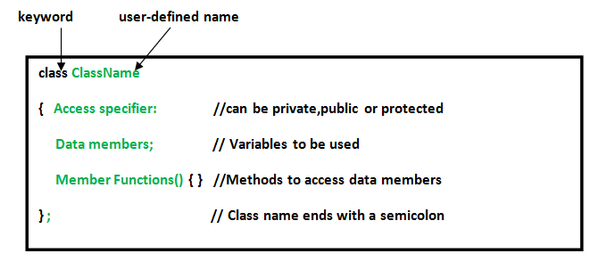
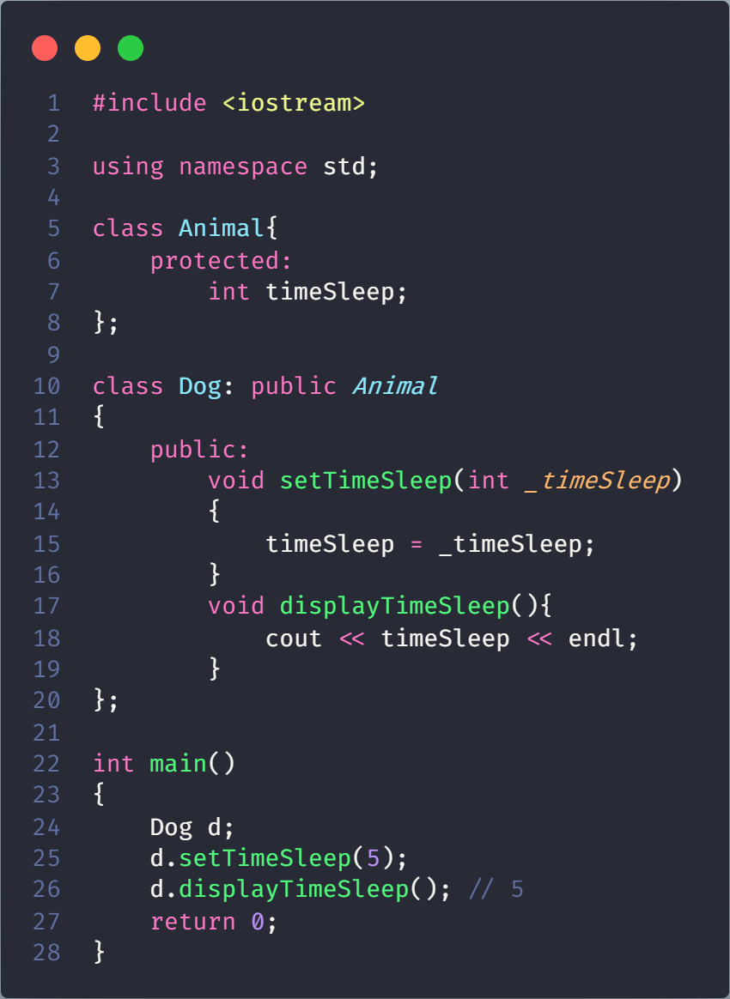
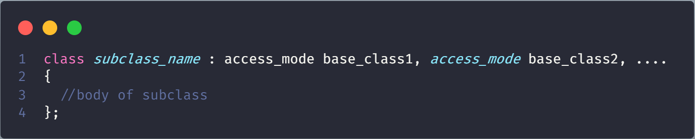
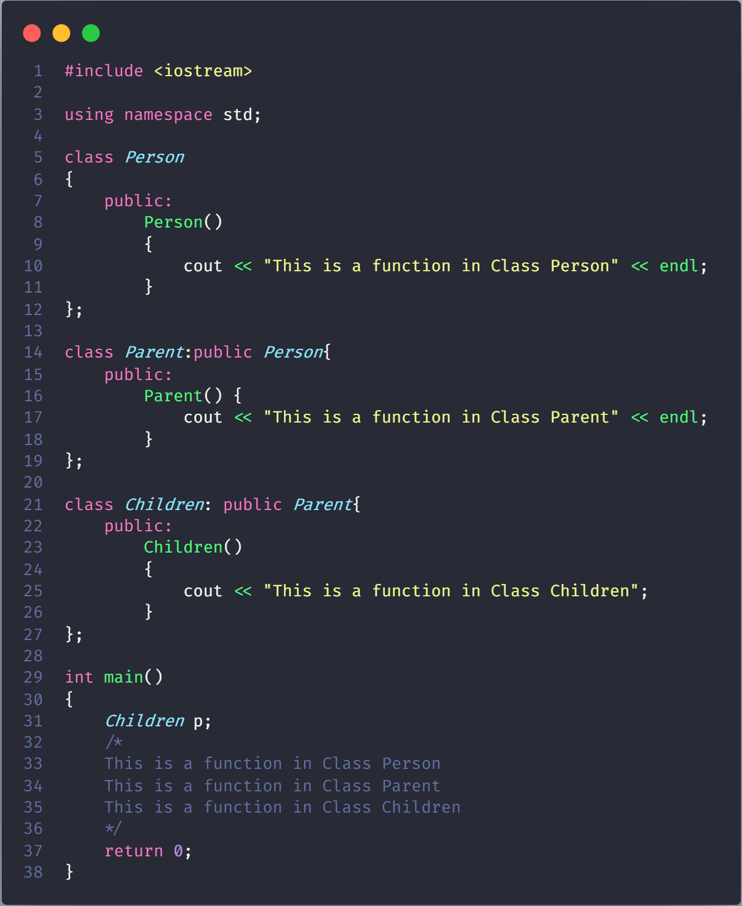
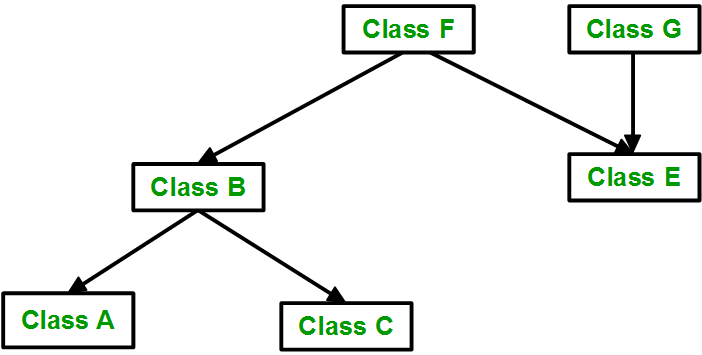
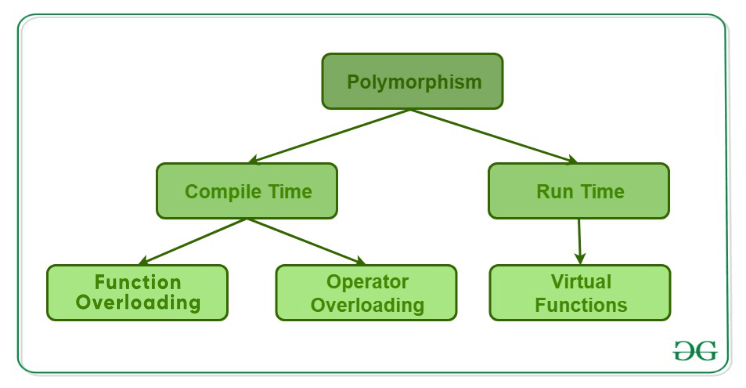

# Lập trình hướng đối tượng trong ngôn ngữ C++

> Bài viết được dựa trên trang [geeksforgeeks](https://www.geeksforgeeks.org/object-oriented-programming-in-cpp/)

## Giới thiệu

- OOP được viết tắt của Object-oriented programming. Mục đích là miêu tả thế giới thực gồm các tính chất: thừa kế(inheritance), che dấu thông tin(hiding), tính đa hình(polymorphism)

- Dùng cấu trúc Class trong ngôn ngữ C++ để biểu diễn. Là một dạng cấu trúc dữ liệu do người dùng tự định nghĩa, bao gồm các dữ liệu cũng như phương thức của cấu trúc dữ liệu đó. Có thể được truy cập và sử dụng bằng cách tạo ra phiên bản khác

### Class trong ngôn ngữ C++

- Class là một bản vẽ(blue-print) thiết kế cho một đối tượng mà người dùng miêu tả. Class cũng có thể là một bản vẽ thiết kế cho một nhóm các đối tượng khi chúng có cùng một số đặc điểm(properties) và phương thức(behaviours)

- Khi Class được định nghĩa không có bộ nhớ được cấp phát, khi tạo ra thì bộ nhớ được cấp phát

### Object(đối tượng)

- Object là một thực thể(entity) có thể nhận dạng được thông qua đặc trưng và hành vi

- Object chiếm dung lượng bộ nhớ và có địa chỉ được liên kết. Giống như dạng dữ liệu record trong ngôn ngữ Pascal, struct trong ngôn ngữ C

- Khi chương trình thực thi, các Object tương tác và gửi cho nhau tin nhắn. Bản thân Object mang dữ liệu và những đoạn mã để thao tác với dữ liệu tuy nhiên khi tương tác, object chỉ quan tâm loại tin nhắn được chấp nhận và loại phải hồi được Object khác trả về

### Encapsulation(tính đóng gói)

- Encapsulation theo định nghĩa thông thường được hiểu là một đơn vị chứa dữ liệu và thông tin

- Trong lập trình hướng đối tượng, Encapsulation được định nghĩa dùng để liên kết dữ liệu và chức năng thao tác của Object

> Trong một công ty, có các phần khác nhau như phần tài khoản, phần tài chính, phần bán hàng, v.v. Phần tài chính xử lý tất cả các giao dịch tài chính và lưu giữ hồ sơ của tất cả dữ liệu liên quan đến tài chính. Tương tự, bộ phận bán hàng xử lý tất cả các hoạt động liên quan đến bán hàng và lưu giữ hồ sơ của tất cả các lần bán hàng. Bây giờ có thể nảy sinh một tình huống khi vì lý do nào đó mà một quan chức từ bộ phận tài chính cần tất cả dữ liệu về doanh số bán hàng trong một tháng cụ thể. Trong trường hợp này, anh ta không được phép truy cập trực tiếp vào dữ liệu của phần bán hàng. Trước tiên, anh ta sẽ phải liên hệ với một số nhân viên khác trong bộ phận bán hàng và sau đó yêu cầu anh ta cung cấp dữ liệu cụ thể. Đây là những gì đóng gói là. Ở đây, dữ liệu của bộ phận bán hàng và những nhân viên có thể thao túng chúng được bao bọc dưới một tên duy nhất “bộ phận bán hàng”

- Encapsulation dẫn đến sự trừu tượng hóa(abstraction) hoặc ẩn dữ liệu. Vì sử dụng tính năng Encapsulation chính là ẩn dữ liệu

### Abstraction(tính trừu tượng hóa dữ liệu)

- Tính năng cần thiết và quan trọng trong lập trình hướng đối tượng. Abstraction chỉ hiển thị thông tin cần thiết và ẩn các chi tiết cơ bản, việc triển khai.

> Khi chúng ta lái xe chỉ biết rằng nhấn ga sẽ tăng tốc độ xe hoặc nhấn phanh sẽ dừng xe nhưng không ai hiểu quá rõ về cách nhấn ga, tốc độ thực sự tăng lên như thế nào, cũng như  cơ cấu bên trong của ô tô hay việc thực hiện chân ga, phanh, vv trên ô tô.

- Class trong C++ sẽ quyết định thành viên dữ liệu nào hiển thị và không hiển thị ra thế giới bên ngoài

> Ví dụ, khi chúng ta dùng thuật toán __gcd trong ngôn ngữ C++ được khai báo trong thư viện algorithm. Chúng ta chỉ truyền đối số mà không quan tâm hàm đó sẽ thực hiện thuật toán như thế nào

### Polymorphism(tính đa hình)

- Polymorphism là một khả năng hiển thị một thông báo nhiều dạng

> Một người cùng một lúc có thể có những đặc điểm khác nhau. Giống như một người đàn ông đồng thời là một người cha, một người chồng, một nhân viên. Vì vậy, cùng một người có các hành vi khác nhau trong các tình huống khác nhau

- C++ cho phép thực hiện phương thức nạp chồng toán tử và nạp chồng hàm

  - Nạp chồng toán tử(Operator Overloading): Thực hiện các phép toán nhưng với đối tượng khác, cách thức khác nhau
  
  - Nạp chồng hàm(Function Overloading): Thực hiện các tác vụ khác nhau chỉ bằng một tên hàm

    

> Polymorphism được sử dụng rộng rãi để thực thi inheritance

### Inheritance(tính thừa kế)

- Khả năng một lớp lấy các thuộc tính và đặc điểm của lớp khác. Là một đặc tính quan trọng trong lập trình hướng đối tượng

- Các định nghĩa

  - Sub Class(lớp con): một lớp thừa hưởng các đặc tính từ một lớp khác, được gọi là Sub Class hoặc Derived Class

  - Super Class(lớp siêu cấp): là lớp cho lớp con thừa hưởng các đặc tính, được gọi là Base Class hoặc Super Class

- Reusability(khả năng tái sử dụng): khi tạo một lớp mới và đã có một số lớp được xây dựng có các đặc điểm và tính năng mà chúng ta muốn, chúng ta có thể lấy lớp mới từ lớp đã có

    

### Dynamic Binding

Ràng buộc động: mã được thực thi để đáp ứng lệnh gọi hàm được quyết định trong thời gian chạy, C++ hỗ trợ bằng từ khóa **virtual**

### Message Passing (truyền thông điệp)

- Các Objects trao đổi với nhau bằng việc gửi và nhận thông tin. Thông báo cho một đối tượng là một yêu cầu thực hiện một thủ tục và do đó sẽ gọi một hàm trong đối tượng nhận tạo ra kết quả mong muốn

- Message Passing liên quan đến việc xác định tên của đối tượng, chức năng và thông tin được gửi đi

## Classes và Objects

### Class

> Hãy xem xét Class of Cars. Có thể có nhiều xe với các tên và thương hiệu khác nhau nhưng tất cả chúng đều có chung một số đặc tính như tất cả chúng sẽ có 4 bánh, Giới hạn tốc độ, Phạm vi số dặm, v.v ... Vì vậy, ở đây, Xe là một class và bánh xe, giới hạn tốc độ, quãng đường là thuộc tính của chúng

- Lớp là kiểu dữ liệu do người dùng định nghĩa trong đó có các data members and member functions.

- Data members là data variables, member functions là các hàm để vận dụng these variables. Data members cùng với member functions xác định các thuộc tính và phương thức của đối tượng trong một lớp.

- Trong ví dụ trên về Class Car, data members sẽ là giới hạn tốc độ, quãng đường đi được, v.v. Các member functions có thể là áp dụng phanh, tăng tốc độ, v.v.

### Objects

Objects là một trường hợp của Class. Khi định nghĩa một Class sẽ không tốn bộ nhớ nhưng khi khai Class được khởi tạo(Objects được hình thành) sẽ tốn bộ nhớ

### Defining Class and Declaring Objects

#### Defining Class

#### Declaring Objects

- Khi Class được định nghĩa, only the specification for the object được tạo nên. Không có bộ nhớ nào được sử dụng hay cấp phát

- Để sử dụng dữ liệu và truy cập function được định nghĩa bởi class cần phải tạo Objects

### Accessing data members and member functions

Data members and member functions của class members được truy cập thông qua dot('.') operator của Object

> Nếu tên Object là Obj, muốn truy cập member function có tên printName() viết: Obj.printName()

#### Accessing data members

The public data members được truy cập theo cách tương tự như trên. Tuy nhiên, the private data members thì không cho phép truy cập trực tiếp thông qua Object. Accessing a data member phụ thuộc vào quyền kiểm soát truy cập của data member

##### Access Modifiers in C++

- Access Modifiers được sử dụng để triển khai một khía cạnh quan trọng của OOP là _**Data Hiding**_

> Một nhóm Nghiên cứu và Phân tích , có 10 thành viên đã nắm giữ thông tin bí mật nhạy cảm liên quan đến an ninh quốc gia. Bây giờ chúng ta có thể tương quan các thành viên cốt lõi này với dữ liệu hoặc các chức năng của một lớp, chúng có thể tương quan với phần của nhóm. 10 thành viên này có thể trực tiếp truy cập thông tin bí mật từ cánh của họ (lớp), nhưng bất kỳ ai ngoài 10 thành viên này không thể truy cập trực tiếp thông tin này, tức là các chức năng bên ngoài khác với những chức năng phổ biến trong lớp không thể truy cập thông tin không có quyền đối với họ, mà không có đặc quyền được chỉ định (chẳng hạn như những đặc quyền thuộc sở hữu của lớp bạn bè và lớp kế thừa như sẽ thấy trong bài viết này phía trước) hoặc quyền truy cập vào một trong 10 thành viên này được phép truy cập trực tiếp vào thông tin bí mật (tương tự như cách riêng tư các thành viên của một lớp có thể được truy cập ở thế giới bên ngoài thông qua các chức năng thành viên công cộng của lớp có quyền truy cập trực tiếp vào các thành viên riêng). Đây là những gì ẩn dữ liệu trong thực tế.

- Có 3 loại Access Modifiers trong C++:

  - **Public**

  - **Private**

  - **Protected**

> Khi khai báo Class, không đặt bất cứ trong Access Modifiers nào thì chương trình biên dịch theo nghĩa Private (C++)

###### Public

Class member bao gồm Data members và member functions khai báo dưới dạng public đều được truy cập bởi các thành phần trong chương trình. Dùng toán tử (.) để truy cập

###### Private

- Class member khai báo dạng private chỉ được truy cập từ trong Class

- Chỉ duy nhất member functions và hàm _**friend**_ truy cập được các thành phần khi trong private

> Readmore [here](./friend/README.md)

- Có thể truy cập private member của class bằng cách sử dụng public member function của chính class đó

###### Protected

Protected access modifier is similar to private access modifier, sẽ không bị truy cập trừ trường hợp có từ khóa **friend** . Sự khác việt với private access modifier là cho phép bất kì subclass(derived class) tới chính chính nó

> Sự truy cập từ subclass(derived class) có thể chỉnh sửa thông qua **modes of Inheritance**

## Inheritance in C++

Khả năng class lấy được properties và characteristics từ class khác gọi là **Inheritance**, một phần quan trọng trong OOP

**Sub Class**: class mà inherits properties từ class khác

**Super Class**:  class mà properties được inherited từ sub class, được gọi là Base Class hoặc Super Class

### Why and when to use inheritance?

- Xem xét các loại phương tiện xe. Khi muốn tạo Class để miêu tả về Bus, Car và Truck. Các methods fuelAmount(), capacity(), applyBrakes() đều giống cho cả 3 Class. Nếu code cả 3 methods cho các Class sẽ tốn thời gian, increases the chances of error and data redundancy

  

- Syntax:

  

- subclass_name là tên của sub class, access_mode is the mode in which you want to inherit this sub class for example: public, private etc. and base_class_name là tên của base class from which you want to inherit the sub class.

> A derived class doesn’t inherit access to private data members. However, it does inherit a full parent object, which contains any private members which that class declares

- the ‘Child’ class is publicly inherited from the ‘Parent’ class so the public data members of the class ‘Parent’ will also be inherited by the class ‘Child’

### Modes of Inheritance

**Public mode**: If we derive a sub class from a public base class. Then the public member of the base class will become public in the derived class and protected members of the base class will become protected in derived class.

**Protected mode**: If we derive a sub class from a Protected base class. Then both public member and protected members of the base class will become protected in derived class

**Private mode**: If we derive a sub class from a Private base class. Then both public member and protected members of the base class will become Private in derived class.

> The private members in the base class cannot be directly accessed in the derived class, while protected members can be directly accessed.

The below table summarizes the above three modes and shows the access specifier of the members of base class in the sub class

### Types of Inheritance

#### Single Inheritance

A class is allowed to inherit from only one class: one sub class is inherited by one base class only

#### Multiple Inheritance

- A feature of C++

- One **sub class** is inherited from more than one **base classes**

ReadMore:

#### Multilevel Inheritance

A derived class is created from another derived class

#### Hierarchical Inheritance

More than one sub class is inherited from a single base class. i.e. more than one derived class is created from a single base class.

#### Hybrid (Virtual) Inheritance

Hybrid Inheritance is implemented by combining more than one type of inheritance

> For example: Combining Hierarchical inheritance and Multiple Inheritance

#### A special case of hybrid inheritance : Multipath inheritance

A derived class with two base classes and these two base classes have one common base class is called multipath inheritance

> An ambiguity can arrise in this type of inheritance

In the above example, both ClassB & ClassC inherit ClassA, they both have single copy of ClassA. However ClassD inherit both ClassB & ClassC, therefore ClassD have two copies of ClassA, one from ClassB and another from ClassC.

---

If we need to access the data member a of ClassA through the object of ClassD, we must specify the path from which a will be accessed, whether it is from ClassB or ClassC

##### Scope resolution operato

Using scope resolution operator we can manually specify the path from which data member a will be accessed

**Note : Still, there are two copies of ClassA in ClassD.**

##### Virtual base class

According to the above example, ClassD has only one copy of ClassA, therefore, statement after will overwrite the value of a, given at statement before

> According to the above example, ClassD has only one copy of ClassA

## Polymorphism in C++

The word polymorphism means having many forms. In simple words, we can define polymorphism as the ability of a message to be displayed in more than one form. A real-life example of polymorphism, a person at the same time can have different characteristics. Like a man at the same time is a father, a husband, an employee. So the same person posses different behavior in different situations

### Compile time Polymorphism

This type of polymorphism is achieved by function overloading or operator overloading.

#### Function Overloading

When there are multiple functions with same name but different parameters then these functions are said to be overloaded. Functions can be overloaded by change in number of arguments or/and change in type of arguments

Rules of Function Overloading: [here](./FunctionOverloading/README.md)

#### Operator Overloading

C++ also provide option to overload operators

> we can make the operator (‘+’) for string class to concatenate two strings. We know that this is the addition operator whose task is to add two operands. So a single operator ‘+’ when placed between integer operands , adds them and when placed between string operands, concatenates them.

More detail:[here](./OperatorOverloading/README.md)

### [Runtime polymorphism](virtual/README.md)

Achieved by Function Overriding

#### [Function overriding](OverridingKeyWord/README.md)

On the other hand occurs when a derived class has a definition for one of the member functions of the base class. That base function is said to be **overridden**

## Encapsulation

In normal terms Encapsulation is defined as wrapping up of data and information under a single unit. In Object Oriented Programming, Encapsulation is defined as binding together the data and the functions that manipulates them.

> in a company there are different sections like the accounts section, finance section, sales section etc. The finance section handles all the financial transactions and keep records of all the data related to finance. Similarly the sales section handles all the sales related activities and keep records of all the sales. Now there may arise a situation when for some reason an official from finance section needs all the data about sales in a particular month. In this case, he is not allowed to directly access the data of sales section. He will first have to contact some other officer in the sales section and then request him to give the particular data. This is what encapsulation is. Here the data of sales section and the employees that can manipulate them are wrapped under a single name “sales section”.

Encapsulation also lead to data abstraction or hiding. As using encapsulation also hides the data

In C++ encapsulation can be implemented using _**Class and access modifiers**_

> In the above program the variable countTree is made private. This variable can be accessed and manipulated only using the functions get() and set() which are present inside the class. Thus we can say that here, the variable countTree and the functions get() and set() are binded together which is nothing but encapsulation.

### Role of access specifiers in encapsulation

As we have seen in above example, access specifiers plays an important role in implementing encapsulation in C++. The process of implementing encapsulation can be sub-divided into two steps:

- The data members should be labeled as **private** using the private access specifiers

- The member function which manipulates the data members should be labeled as **public** using the public access specifier

## Abstraction

Data abstraction is one of the most essential and important feature of object oriented programming in C++. Abstraction means displaying only essential information and hiding the details. Data abstraction refers to providing only essential information about the data to the outside world, hiding the background details or implementation.

> Consider a real life example of a man driving a car. The man only knows that pressing the accelerators will increase the speed of car or applying brakes will stop the car but he does not know about how on pressing accelerator the speed is actually increasing, he does not know about the inner mechanism of the car or the implementation of accelerator, brakes etc in the car. This is what abstraction is.

**Abstraction using Classes**: We can implement Abstraction in C++ using classes. Class helps us to group data members and member functions using available access specifiers. A Class can decide which data member will be visible to outside world and which is not.

**Abstraction in Header file**: One more type of abstraction in C++ can be header files. For example, consider the pow() method present in math.h header file. Whenever we need to calculate power of a number, we simply call the function pow() present in the math.h header file and pass the numbers as arguments without knowing the underlying algorithm according to which the function is actually calculating power of numbers.

**Abstraction using access specifiers**: Access specifiers are the main pillar of implementing abstraction in C++. We can use access specifiers to enforce restrictions on class members

- Members declared as **public** in a class, can be accessed from anywhere in the program.

- Members declared as **private** in a class, can be accessed only from within the class. They are not allowed to be accessed from any part of code outside the class.

We can easily implement abstraction using the above two features provided by access specifiers. Say, the members that defines the internal implementation can be marked as private in a class. And the important information needed to be given to the outside world can be marked as public. And these public members can access the private members as they are inside the class.

**Advantages of Data Abstraction**:

- Helps the user to avoid writing the low level code

- Avoids code duplication and increases reusability.

- Can change internal implementation of class independently without affecting the user.

- Helps to increase security of an application or program as only important details are provided to the user.

## Function Overloading in C++

Function overloading is a feature of object oriented programming where two or more functions can have the same name but different parameters.

When a function name is overloaded with different jobs it is called Function Overloading.

In Function Overloading “Function” name should be the same and the arguments should be different.

Function overloading can be considered as an example of polymorphism feature in C++.

### How Function Overloading works?

-Exact match:- (Function name and Parameter)

- If a not exact match is found:–
-> Char, Unsigned char, and short are promoted to an int.
-> Float is promoted to double

- If no match found:
->C++ tries to find a match through the standard conversion.

- ELSE ERROR

## Operator Overloading in C++

[Here](OperatorOverloading/README.md)
