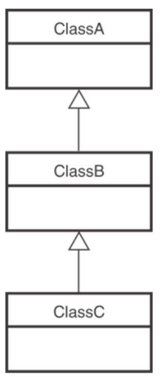
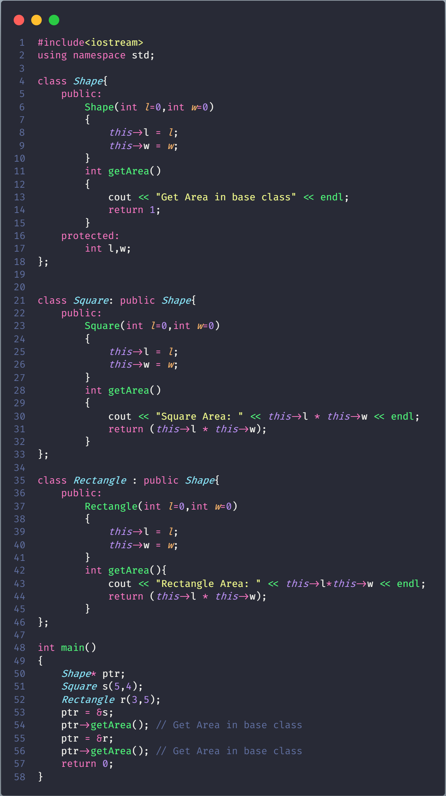
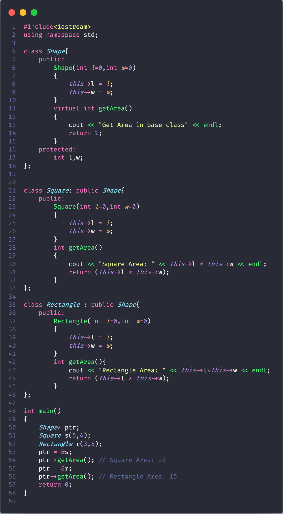
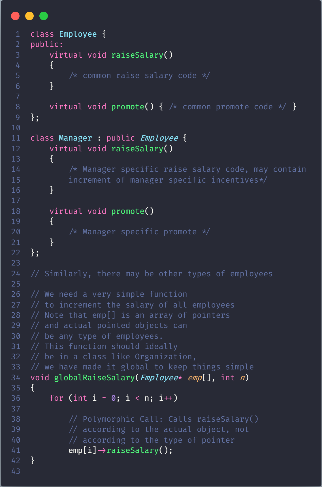

# Virtual Functions and Runtime Polymorphism in C++

**This article introduces the concept of polymorphism and virtual functions, and their use in inheritance.**

## Definitions

- A virtual function is a member function which is declared in the base class using the keyword virtual and is re-defined (Overridden) by the derived class.

- The term Polymorphism means the ability to take many forms. It occurs if there is a hierarchy of classes which are all related to each other by inheritance

    

    > In C++ what this means is that if we call a member function then it could cause a different function to be executed instead depending on what type of object invoked it.

The idea is that [Virtual functions](VirtualFunction/README.md) are called according to the type of the object instance pointed to or referenced, not according to the type of the pointer or reference. In other words, virtual functions are resolved late, at runtime.

## Without Virtual Functions

Đơn giản là gọi hàm getArea() ở Base Class, nhưng khi có virtual sẽ gọi hàm ở Derived Class định nghĩa

> we store the address of each child class Rectangle and Square object in s and then we call the get_Area() function on it,ideally, it should have called the respective get_Area() functions of the child classes but instead it calls the get_Area() defined in the base class. This happens due static linkage which means the call to get_Area() is getting set only once by the compiler which is in the base class.

## Using Virtual Functions

Virtual functions allow us to create a list of base class pointers and call methods of any of the derived classes without even knowing kind of derived class object.
**For example**: Consider an employee management software for an organization. Let the code has a simple base class Employee , the class contains virtual functions like *raiseSalary(), transfer(), promote(),* etc. Different types of employees like Manager, Engineer, etc. may have their own implementations of the virtual functions present in base class Employee.
In our complete software, we just need to pass a list of employees everywhere and call appropriate functions without even knowing the type of employee. For example, we can easily raise the salary of all employees by iterating through the list of employees. Every type of employee may have its own logic in its class, but we don’t need to worry about them because if raiseSalary() is present for a specific employee type, only that function would be called.

> Like globalRaiseSalary(), there can be many other operations that can be performed on a list of employees without even knowing the type of the object instance.

## How does the compiler perform runtime resolution?

- _**vtable**_: A table of function pointers, maintained per class.

- _**vptr**_: A pointer to vtable, maintained per object instance

Compiler adds additional code at two places to maintain and use vptr.

- Code in every constructor. This code sets the vptr of the object being created. This code sets vptr to point to the vtable of the class.

- Code with polymorphic function call. Wherever a polymorphic call is made, the compiler inserts code to first look for vptr using base class pointer or reference. Once vptr is fetched, vtable of derived class can be accessed. Using vtable, address of derived class function is accessed and called.

## Is this a standard way for implementation of run-time polymorphism in C++?

The C++ standards do not mandate exactly how runtime polymorphism must be implemented, but compilers generally use minor variations on the same basic model.
