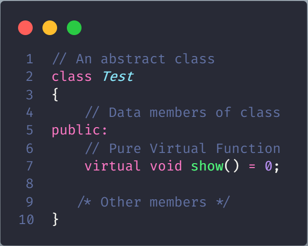
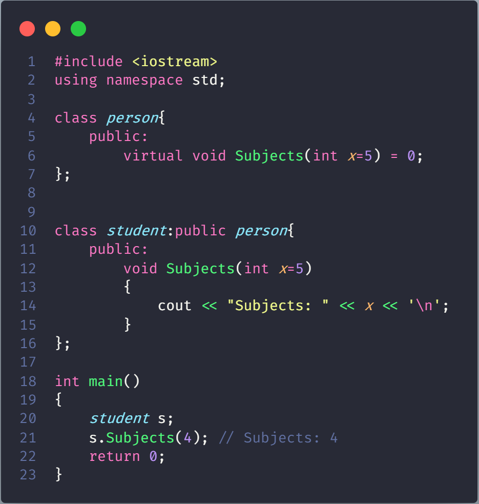
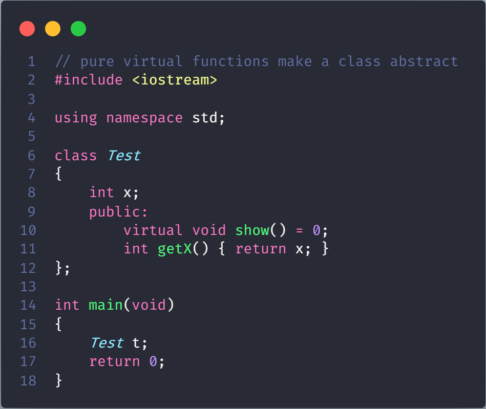
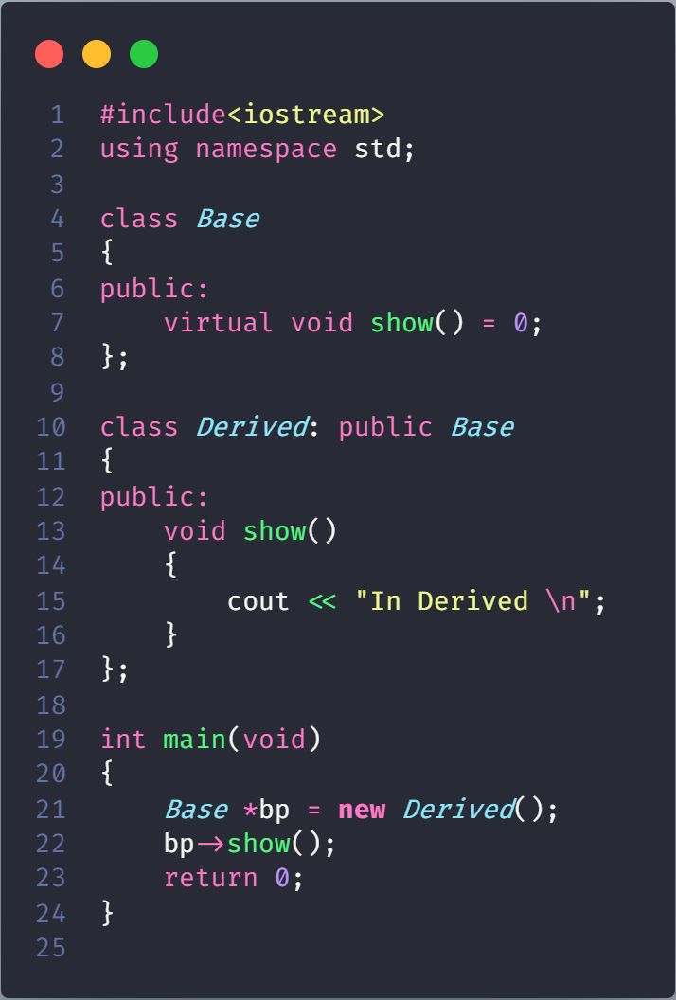
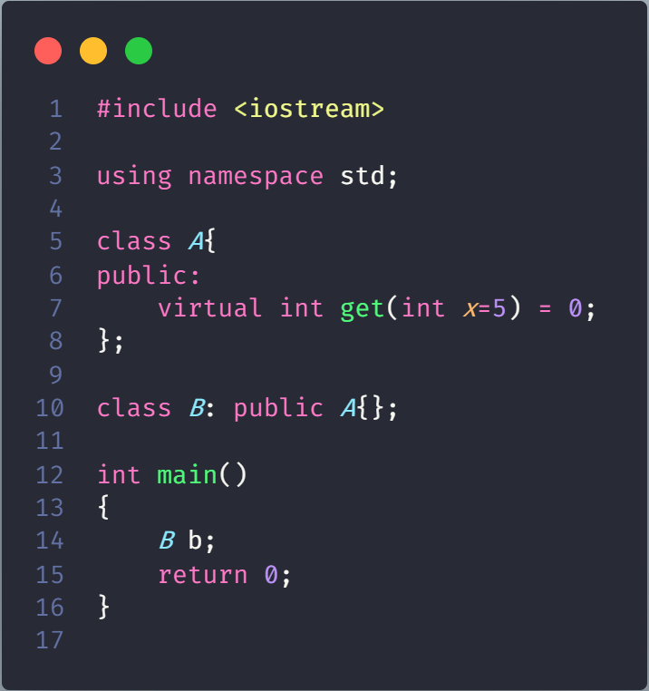
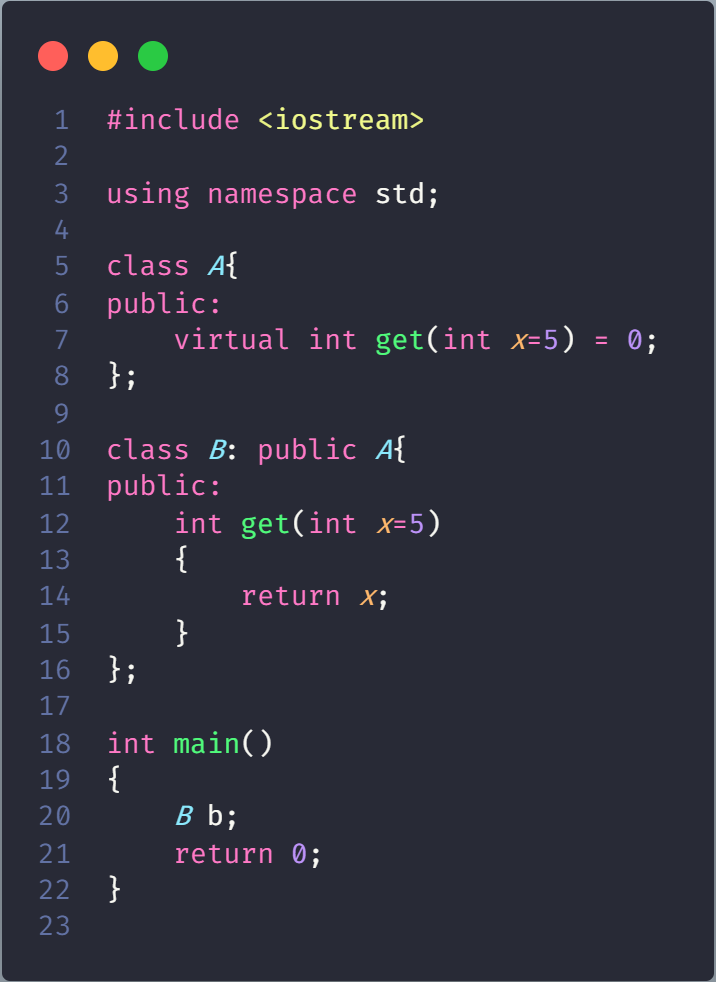
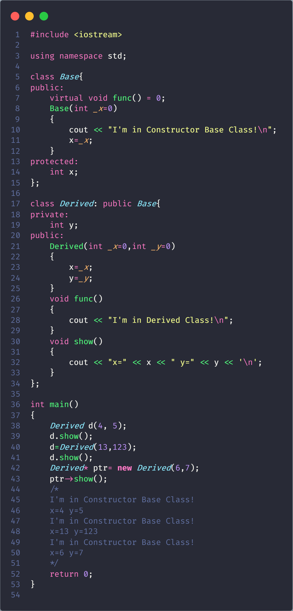

# Pure Virtual Functions and Abstract Classes in C++

Sometimes implementation of all function cannot be provided in a base class because we don’t know the implementation. Such a class is called abstract class. For example, let Shape be a base class. We cannot provide implementation of function draw() in Shape, but we know every derived class must have implementation of draw(). Similarly an Animal class doesn’t have implementation of move() (assuming that all animals move), but all animals must know how to move. We cannot create objects of abstract classes.

A pure virtual function (or abstract function) in C++ is a **virtual function** for which we can have implementation, But we must override that function in the derived class, otherwise the derived class will also become abstract class

**NOTE**: A pure virtual function is declared by assigning 0 in declaration. See the following example.



**A complete example**: A pure virtual function is implemented by classes which are derived from a Abstract class



## Some Interesting Facts

### *A class is abstract if it has at least one pure virtual function*



```json
Compiler Error: cannot declare variable 't' to be of abstract type 'Test' 
because the following virtual functions are pure within 'Test': note: virtual void Test::show() 
```

### *We can have pointers and references of abstract class type.*



```json
In Derived
```

### *If we do not override the pure virtual function in derived class, then derived class also becomes abstract class*

Code Wrong



```json
error: cannot declare variable 'b' to be of abstract type 'B'
note: because the following virtual functions are pure within 'B'
```

Code True



### *An abstract class can have constructors.*



## Interface vs Abstract Classes

An interface does not have implementation of any of its methods, it can be considered as a collection of method declarations. In C++, an interface can be simulated by making all methods as pure virtual.

We can think of Interface as header files in C++, like in header files we only provide the body of the class that is going to implement it
