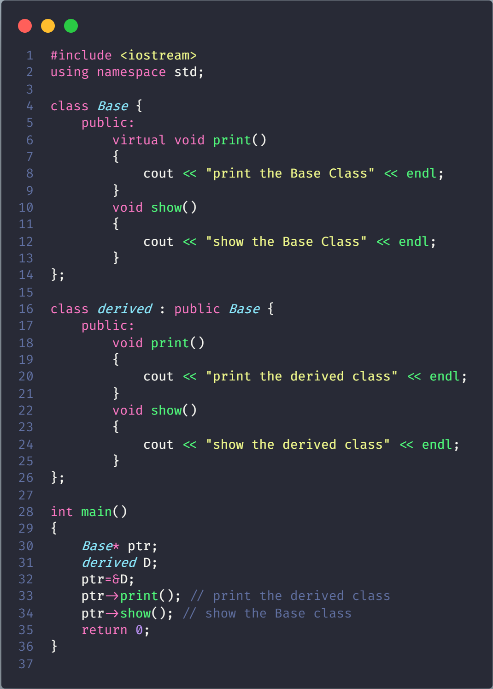
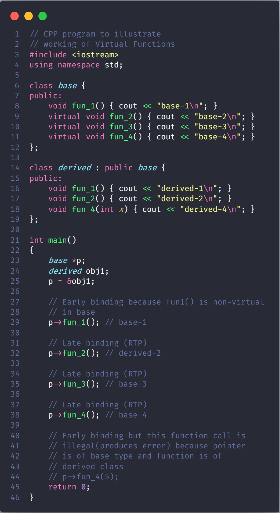

# Virtual Function in C++

A virtual function is a member function which is declared within a base class and is re-defined (overridden) by a derived class. When you refer to a derived class object using a pointer or a reference to the base class, you can call a virtual function for that object and execute the derived class’s version of the function.

- Virtual functions ensure that the correct function is called for an object, regardless of the type of reference (or pointer) used for function call.

- They are mainly used to achieve Runtime polymorphism

- Functions are declared with a **virtual** keyword in base class.

- The resolving of function call is done at runtime.

## Rules for Virtual Functions

- Virtual functions cannot be static.

- A virtual function can be a friend function of another class.

- Virtual functions should be accessed using pointer or reference of base class type to achieve runtime polymorphism.

- The prototype of virtual functions should be the same in the base as well as derived class.

- They are always defined in the base class and overridden in a derived class. It is not mandatory for the derived class to override (or re-define the virtual function), in that case, the base class version of the function is used.

- A class may have [virtual destructor](./VirtualDestructor/README.md) but it cannot have a virtual constructor.

## Compile time (early binding) VS runtime (late binding) behavior of Virtual Functions

**Explanation**: Runtime polymorphism is achieved only through a pointer (or reference) of base class type. Also, a base class pointer can point to the objects of base class as well as to the objects of derived class. In above code, base class pointer ‘ptr’ contains the address of object ‘D’ of derived class.Late binding (Runtime) is done in accordance with the content of pointer (i.e. location pointed to by pointer) and Early binding (Compile time) is done according to the type of pointer, since print() function is declared with virtual keyword so it will be bound at runtime (output is print derived class as pointer is pointing to object of derived class ) and show() is non-virtual so it will be bound during compile time (output is show base class as pointer is of base type).

**NOTE**: If we have created a virtual function in the base class and it is being overridden in the derived class then we don’t need virtual keyword in the derived class, functions are automatically considered as virtual functions in the derived class.

## Working of virtual functions (concept of VTABLE and VPTR)

if a class contains a virtual function then compiler itself does two things.

- If object of that class is created then a virtual pointer (VPTR) is inserted as a data member of the class to point to VTABLE of that class. For each new object created, a new virtual pointer is inserted as a data member of that class.

- Irrespective of object is created or not, class contains as a member a static array of function pointers called VTABLE. Cells of this table store the address of each virtual function contained in that class.

**Explanation**: Initially, we create a pointer of type base class and initialize it with the address of the derived class object. When we create an object of the derived class, the compiler creates a pointer as a data member of the class containing the address of VTABLE of the derived class

Initially, we create a pointer of type base class and initialize it with the address of the derived class object. When we create an object of the derived class, the compiler creates a pointer as a data member of the class containing the address of VTABLE of the derived class

**NOTE**: fun_4(int) in derived class is different from virtual function fun_4() in base class as prototypes of both the functions are different.
