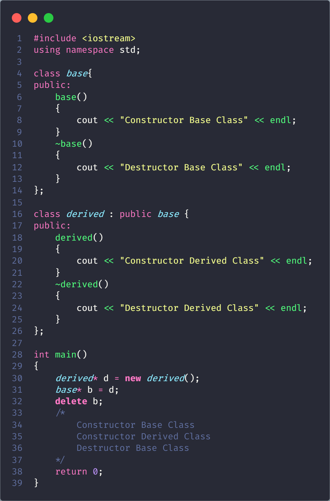
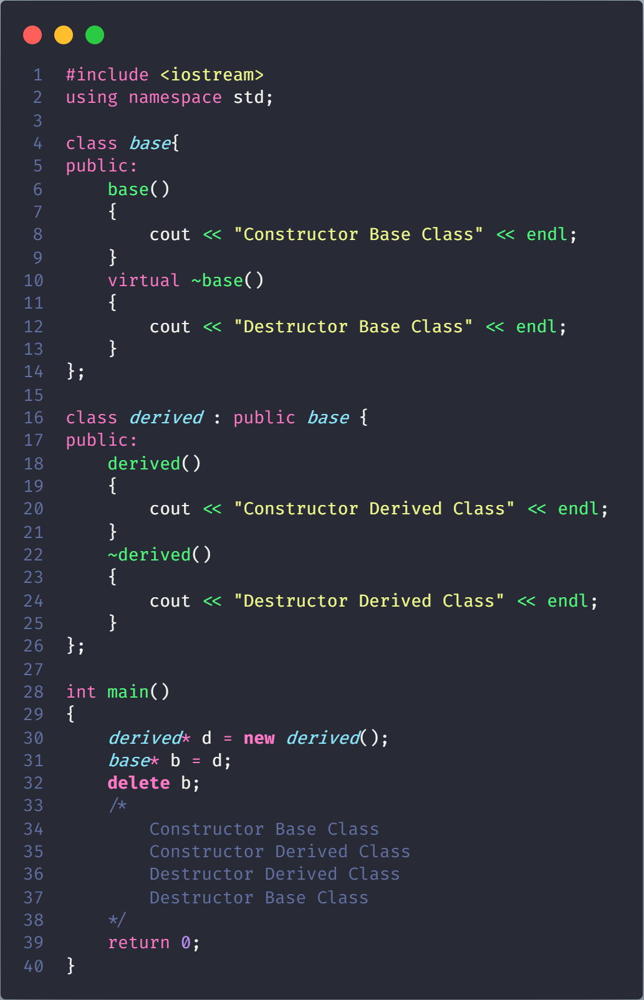

# Virtual Destructor

Deleting a derived class object using a pointer of base class type that has a non-virtual destructor results in undefined behavior. To correct this situation, the base class should be defined with a virtual destructor

Making base class destructor virtual guarantees that the object of derived class is destructed properly, i.e., both base class and derived class destructors are called.

As a guideline, any time you have a virtual function in a class, you should immediately add a virtual destructor (even if it does nothing). This way, you ensure against any surprises later.
