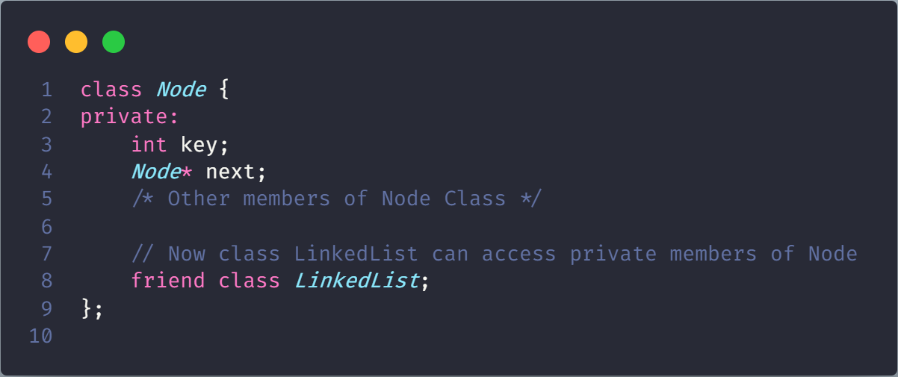
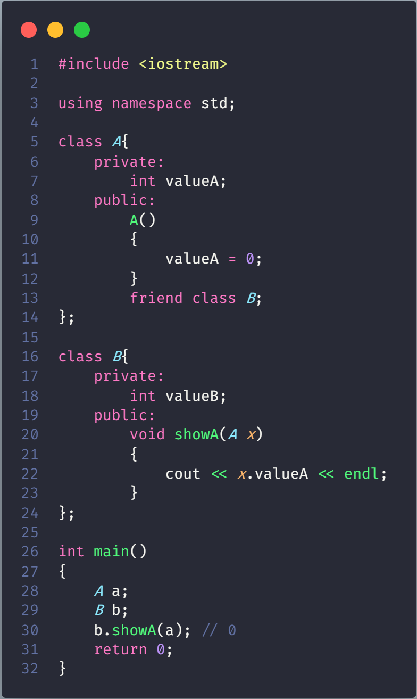
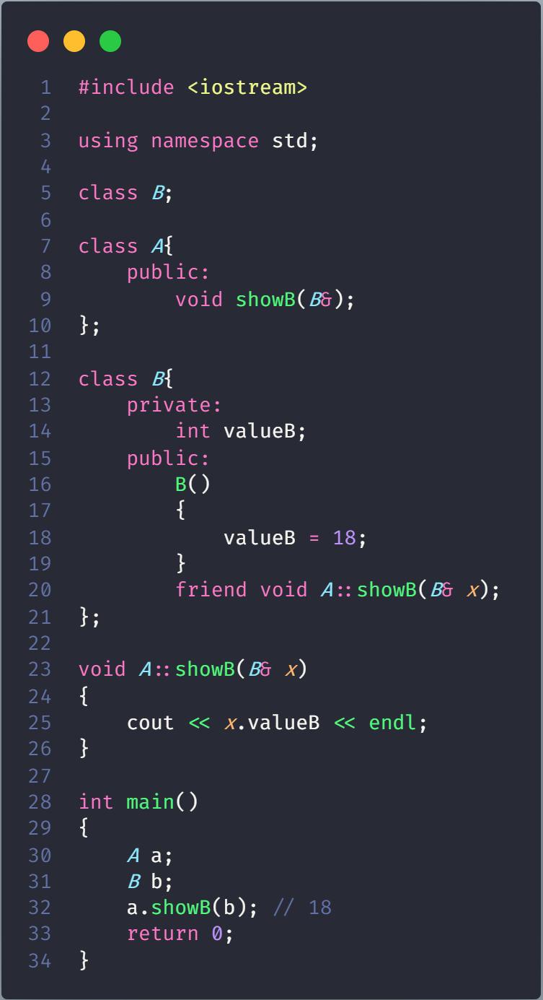
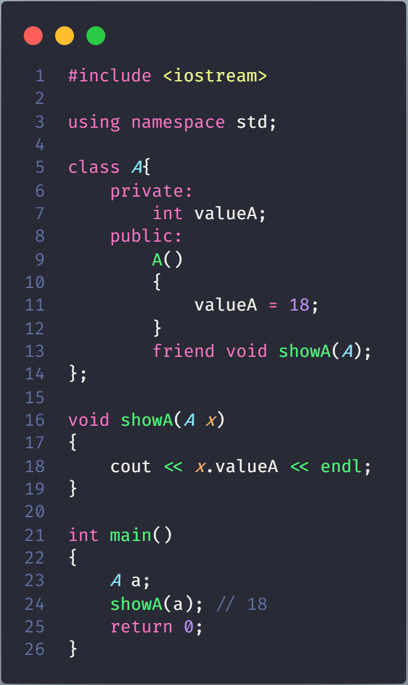

# Friend class and function in C++

- **Friend Class**: Class dạng _**friend**_  có thể truy cập **private** và **protected** members của class chứa Friend Class

    

> For example, a LinkedList class may be allowed to access private members of Node.

- **Friend function**: Function dạng _**friend**_ được quyền truy cập đến **private** và **protected** members của class chứa Friend function

    

## Important points about friend functions and classes

- Friends chỉ nên dùng cho những trường hợp riêng biệt, nếu như có quá nhiều function và class từ bên ngoài được khai báo dạng friend sẽ làm giảm the value of encapsulation of separate classes trong OOP

- Friendship không có tính chất bắc cầu. Nếu class A là bạn của class B, không có nghĩa class B là bạn của class A

- Friendship không có tính chất thừa kế

- The concept of friends is not there in Java.

## Ví dụ về Friend Class

## Ví dụ về Friend Function

> Cần khai báo Class được truy cập trước

## Ví dụ về global friend

## Inheritance and Friendship in C++

In C++, friendship is not inherited. If a base class has a friend function, then the function doesn’t become a friend of the derived class
